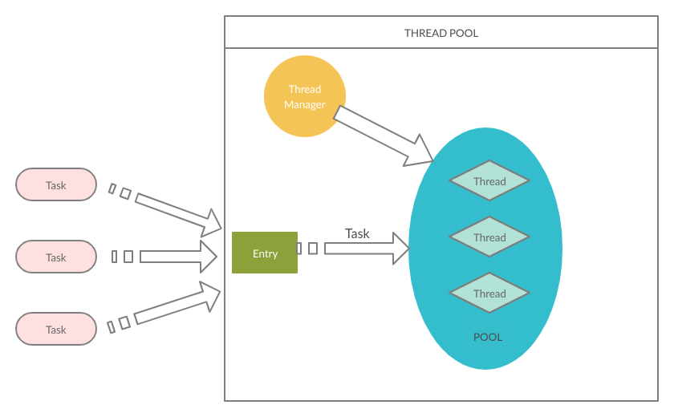

# Custom Thread Pool

Task will be stored in the Entry, and will be taken out by a WorkerThread
* Only 1 task in the Entry at one point of time

ThreadManager
1. When number of assigned-thread(thread that executing a task) equal to corePoolSize and a new task is in the Entry, then the number of WorkerThread is increased one-by-one up to maxPoolSize.

2. When number of assigned-thread equal to maxPoolSize and a new task is in the Entry, we reject that task.

3. Eliminate WorkerThread that are not core thread when they are not needed.
